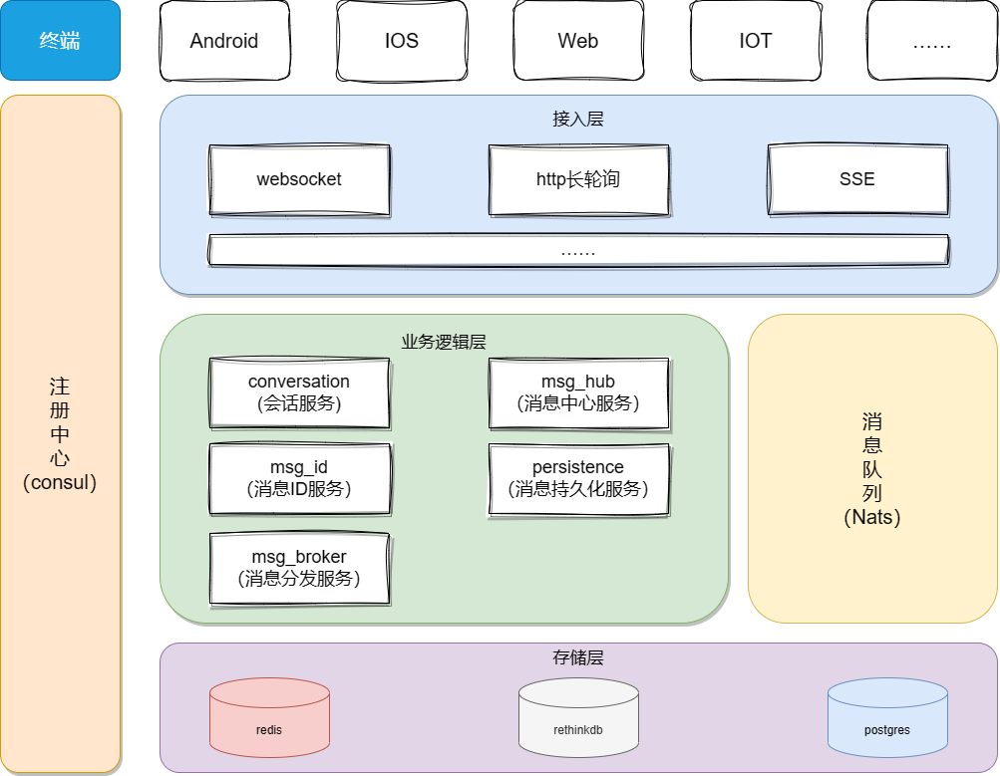

## 项目介绍

- qucik-im-core项目初衷不是打造一个完整的即时通信项目，而是提供一个易于集成、扩展且轻量级并高性能的实时消息模块。

- 本项目提供完整的HTTP API接入文档，可接入任何适用场景，包括且不限于*客服系统*、*OA系统*等依赖实时消息功能的产品中。

- 本项目适用Go语言开发，目标是*轻*、*快*、*稳*，并提供完整的链路追踪功能，以便于快速梳理模块间依赖关系以便对可能产生的问题进行快速定位以及排查。

- 本项目支持单用户*多协议*、*多平台*同时登录，目前集成消息网关协议有*websocket*、*sse*、*poll*，终端可根据场景以及习惯来自定选择不同协议进行接入。

- 本项目不对任何*类型*数据进行硬限制，包括且不限于*会话类型*、*消息类型*等，为接入此项目的产品提供最自由的方案进行接入。

## 配置优先级

命令行参数 > 配置文件 > 环境变量

## 项目编译&镜像构建

- 网关服务

    ```bash
    # 编译项目
    go build -ldflags="-s -w" -o ./gateway ./application/gateway/cmd/gateway.go
    # 构建docker镜像
    docker build -f ./deploy/dockerfile/gateway/Dockerfile -t quickim/gateway .
    ```
    

- 会话服务

    ```bash
    # 编译项目
    go build -ldflags="-s -w" -o conversation ./application/services/conversation/server.go
    # 构建docker镜像
    docker build -f ./deploy/dockerfile/conversation/Dockerfile -t quickim/conversation .
    ```

- 消息分发服务

    ```bash
    # 编译项目
    go build -ldflags="-s -w" -o msgbroker ./application/services/msgbroker/server.go
    # 构建docker镜像
    docker build -f ./deploy/dockerfile/msgbroker/Dockerfile -t quickim/msgbroker .
    ```

- 消息中心服务

    ```bash
    # 编译项目
    go build -ldflags="-s -w" -o msghub ./application/services/msghub/server.go
    # 构建docker镜像
    docker build -f ./deploy/dockerfile/msghub/Dockerfile -t quickim/msghub .
    ```

- 消息ID服务

    ```bash
    # 编译项目
    go build -ldflags="-s -w" -o msgid ./application/services/msgid/server.go
    # 构建docker镜像
    docker build -f ./deploy/dockerfile/msgid/Dockerfile -t quickim/msgid .
    ```

- 消息持久化服务

    ```bash
    # 编译项目
    go build -ldflags="-s -w" -o persistence ./application/services/persistence/server.go
    # 构建docker镜像
    docker build -f ./deploy/dockerfile/persistence/Dockerfile -t quickim/persistence .
    ```

## 项目部署

- docker-compose

    ```bash
    cd deploy
    docker-compose -f components.yaml # 部署依赖环境
    docker-compose -f docker-compose.yaml # 部署项目服务
    docker-compose -f jaeger/all-in-one.yaml # 如开启链路跟踪，则需部署jaeger
    ```

## 资料扩展

[接口文档](./docs/api.md)

### quick-im-core项目架构

